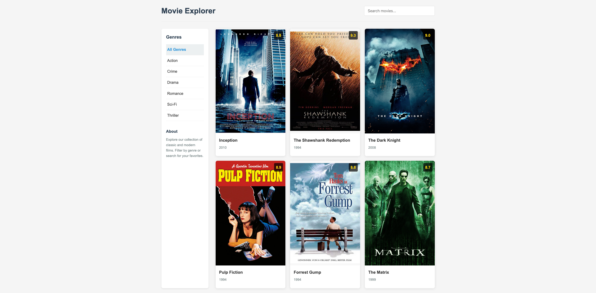

# Movie Explorer App

A React application that allows users to browse and explore a collection of movies. This app was developed as part of a coding assignment focusing on React components and props.



## Features

- Browse movies with an intuitive card-based interface
- Filter movies by genre using the sidebar
- Search for movies by title or director
- View detailed information about each movie by clicking on a card
- Responsive design that works on desktop and mobile devices

## Project Structure

The application is broken down into the following components:

- **App**: The main component that manages state and renders child components
- **Sidebar**: Displays filtering options by genre
- **ItemList**: Renders the grid of movie cards
- **ItemCard**: Displays information for a single movie

## Technologies Used

- React
- TypeScript
- CSS for styling

## Getting Started

### Prerequisites

- Node.js (v14 or above)
- npm

### Installation

1. Clone the repository:

   ```
   git clone https://github.com/james-franchino/react-movie-app.git
   cd movie-explorer
   ```

2. Install dependencies:

   ```
   npm install
   ```

3. Start the development server:

   ```
   npm run dev
   ```

4. Open your browser and navigate to `http://localhost:5173`

## Project Requirements

This project was created following these requirements:

- Create at least 3 React components
- Display test data
- Use props to pass data between components
- Ensure no console errors/warnings

## Data Structure

The movie data is structured as follows:

```typescript
type Movie = {
  id: number;
  title: string;
  director: string;
  year: number;
  genre: string[];
  rating: number;
  runtime: number; // in minutes
  poster: string;
  description: string;
};
```

## Movie Posters

The application uses movie poster images stored in the `src/assets` directory. For best results, posters should have a 2:3 aspect ratio (typical for movie posters).

## Customization

### Adding More Movies

To add more movies to the collection, update the `movies` array in the `movieData.ts` file:

```typescript
export const movies: Movie[] = [
  // Existing movies...
  {
    id: 7,
    title: "New Movie Title",
    director: "Director Name",
    year: 2023,
    genre: ["Action", "Adventure"],
    rating: 8.5,
    runtime: 120,
    poster: "/assets/new_movie.jpg",
    description: "Description of the new movie...",
  },
];
```

### Changing Styles

The app's styling is contained in `App.css`. Modify this file to customize the appearance of the application.

## Future Enhancements

- Add sorting functionality (by year, rating, etc.)
- Implement user authentication for personalized watchlists
- Add a rating system for users to rate movies
- Integrate with a movie API for a larger collection

## Acknowledgements

- Movie data and images are used for educational purposes only
- This project was created as part of a React learning exercise
